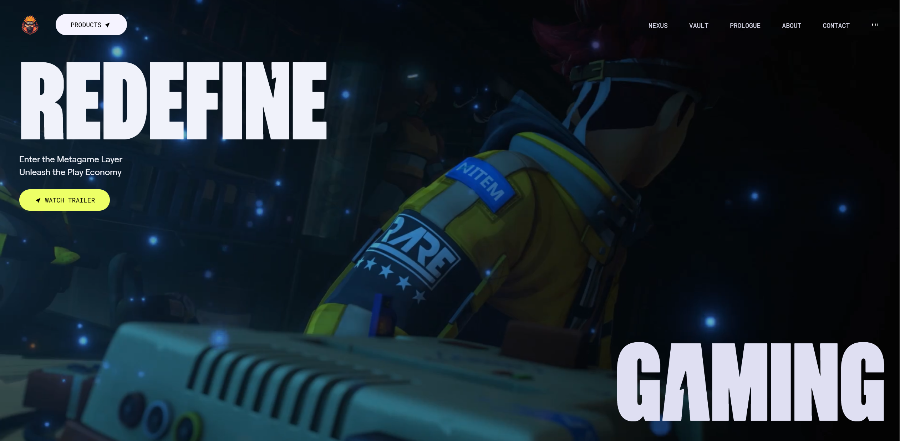
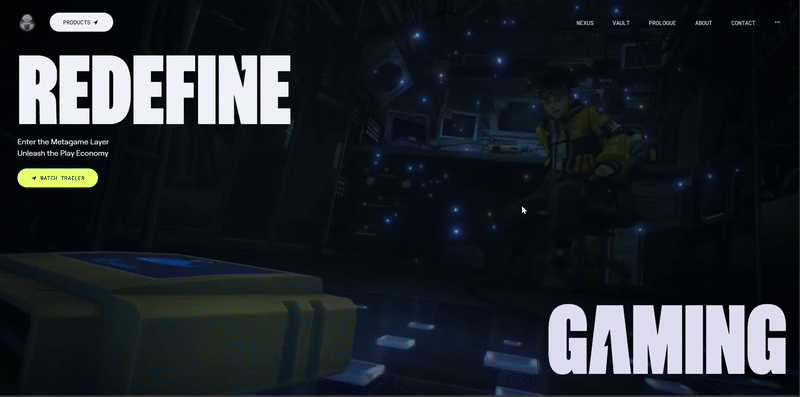

# Award-Winning Game Website – Frontend UI/UX Clone (React + TailwindCSS)

<div align="center">
  <br />
  <br />
  <div>
    
    
    
    
    
  </div>
  <h3 align="center">A pixel-perfect frontend recreation of an award-winning game website – built purely for UI/UX practice</h3>
  <br />
</div>

## 📋 Table of Contents

1. [Introduction](#-introduction)
2. [Tech Stack](#-tech-stack)
3. [Features](#-features)
4. [Quick Start](#-quick-start)
5. [Screenshots](#-screenshots)
6. [Deployment](#-deployment)

---

## 🚀 Introduction

This project is a **purely frontend** clone of an award-winning **game marketing website**, rebuilt from the ground up using **React**, **TailwindCSS**, **Vite**, **Lucide Icons**, and **Radix UI**.

The goal was to **mimic the original design’s animations, layouts, and interactions** with a focus on UI/UX best practices — no backend, no game logic, just the visual experience.

This clone is intended for **educational and portfolio purposes only**. It demonstrates modern frontend workflows, component structuring, and pixel-perfect attention to detail.  
Feel free to fork it, learn from it, and adapt it to your own projects.

---

## ⚙️ Tech Stack

- **React** – Component-based UI development
- **Vite** – Lightning-fast build tool
- **TailwindCSS** – Utility-first CSS for styling
- **Lucide Icons** – Clean and beautiful icon pack
- **Radix UI** – Accessible component primitives
- **TypeScript (optional)** – Type safety and tooling
- **GitHub & Vercel** – Deployment

---

## ⚡️ Features

- 🎮 **Pixel-Perfect UI Recreation**  
  Matches the look and feel of the original award-winning game website.

- 💫 **Immersive Animations**  
  Parallax scrolling, hover effects, fade-ins, and animated backgrounds.

- 📱 **Responsive Design**  
  Fully functional on desktop, tablet, and mobile devices.

- 🖼️ **Game Showcase Sections**  
  Large hero banners, feature highlights, and cinematic visuals.

- 🧭 **Interactive Navigation**  
  Smooth page transitions and dynamic menus.

- 🚀 **One-Click Deployment Ready**  
  Deploy instantly on Vercel from GitHub.

---

## 👌 Quick Start

### Prerequisites

- [Node.js](https://nodejs.org/)
- [Git](https://git-scm.com/)

### Clone and Run

```bash
git clone https://github.com/yourusername/game-website-clone.git
cd game-website-clone
npm install
npm run dev
```

Your app will be available at: [http://localhost:3000](http://localhost:3000)

---

## 🖼️ Screenshots

## <div></div>

## <div></div>

## ☁️ Deployment

### Deploy on Vercel

1. Push your code to GitHub
2. Go to [vercel.com](https://vercel.com)
3. Import your repository
4. Click **Deploy**

Your live website will be hosted on a custom subdomain (e.g. `https://your-name.vercel.app`)

---

## 🔗 Useful Links

- [React Documentation](https://reactjs.org/)
- [Tailwind CSS Docs](https://tailwindcss.com/)
- [Lucide Icons](https://lucide.dev/)
- [Radix UI](https://www.radix-ui.com/)
- [Vite](https://vitejs.dev/)
- [Vercel](https://vercel.com/)

---

Let me know if you'd like me to generate a version with your actual GitHub repo, YouTube URL, or a banner image suggestion!

```

```
